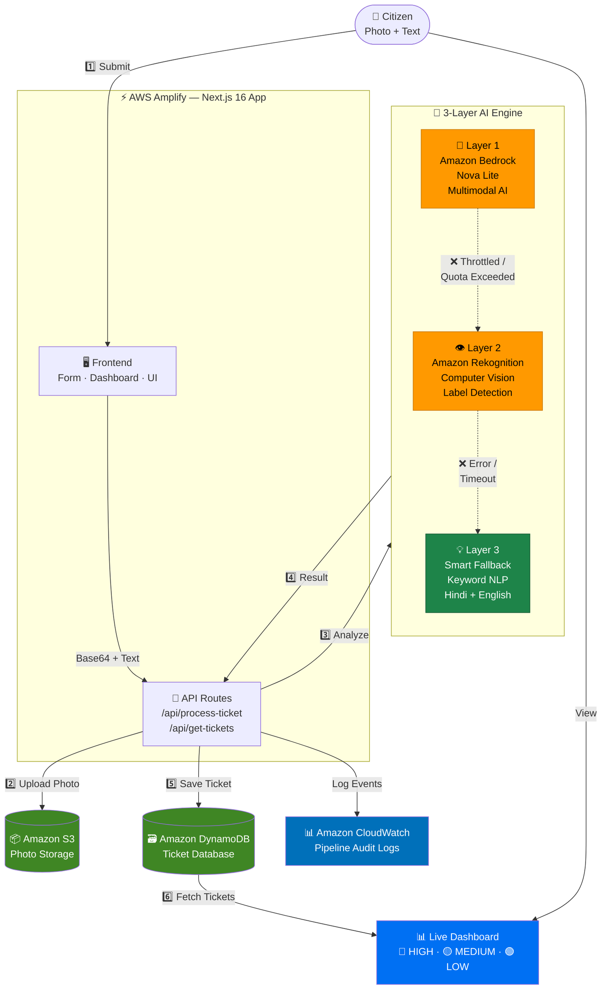
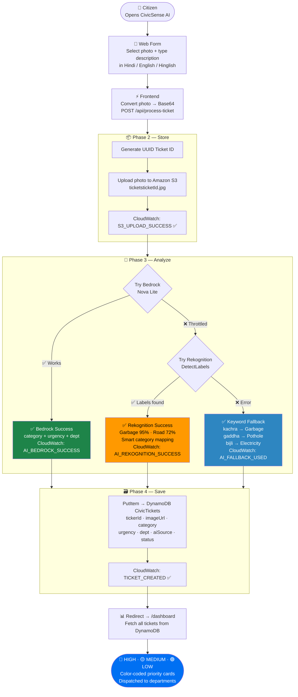
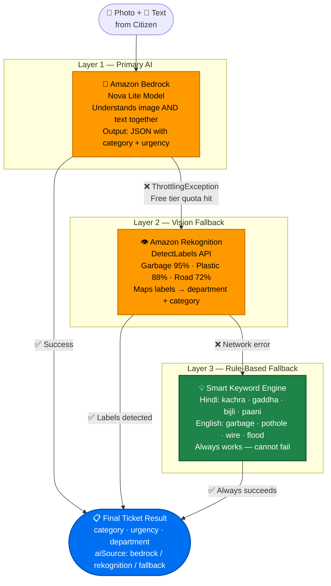
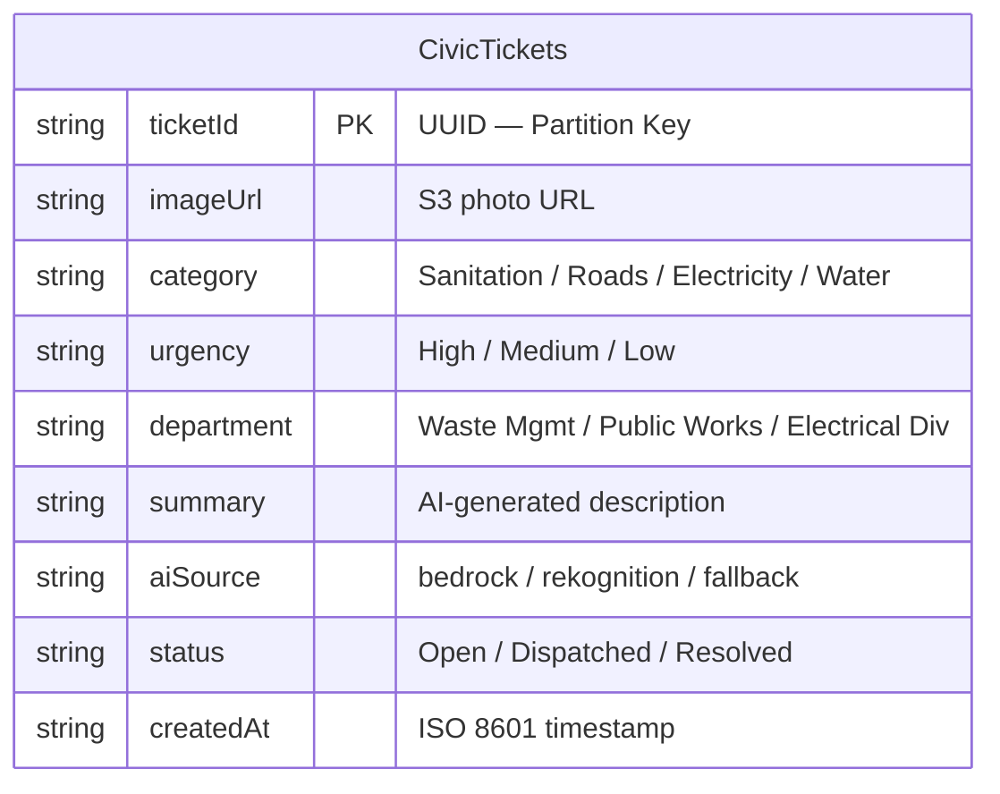
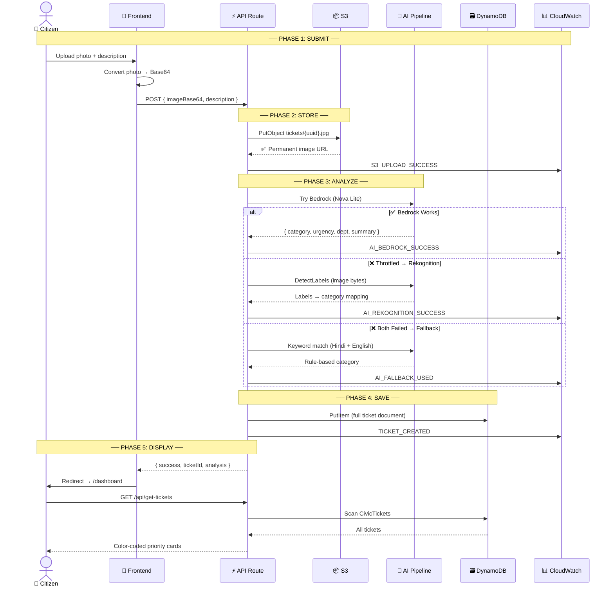

# 🏛️ CivicSense AI — Citizen Grievance Assistant

> **WeMakeDevs × AWS | First Commit Hackathon (Sept 17–20, 2026)**
> **Track:** Ship It | **Builder:** Naveen Singh (@codewithpiyus) | **Team:** 404 Not Founder

<!-- [](https://main.d86p74dnuf9m2.amplifyapp.com) -->
[](https://github.com/piyusdev2006/civicsense-ai)

---

## 🎯 Problem

Municipal complaint portals across India suffer from **poor categorization, vague reports, and zero actionable routing**. Citizens report potholes, garbage, or broken streetlights — but reports disappear into a black hole with no AI triage, no urgency scoring, and no automated department routing.

## 💡 Solution

**CivicSense AI** lets a citizen upload a photo and describe the issue in **any local language** (Hindi, English, Hinglish). A 3-Layer AWS AI Pipeline instantly:

1. 🔍 **Detects** objects in the image (garbage, road damage, wires)
2. 📂 **Categorizes** the issue and scores urgency (High / Medium / Low)
3. 🏢 **Routes** a structured ticket to the correct municipal department
4. 📊 **Displays** all dispatched tickets on a live public dashboard

---

## 🏗️ System Architecture



---

## 🔄 End-to-End Pipeline Flow



---

## 🧠 3-Layer AI Fallback Engine



---

## 🗃️ DynamoDB Data Model



---

## 📡 Complete Request Sequence




## ☁️ AWS Services Used (6 Total)

| # | Service | Role |
|---|---------|------|
| 1 | **AWS Amplify** | Full-stack Next.js hosting with CI/CD from GitHub |
| 2 | **Amazon Bedrock** (Nova Lite) | Multimodal AI — understands image + text together |
| 3 | **Amazon Rekognition** | Computer vision — detects objects in grievance photos |
| 4 | **Amazon S3** | Permanent, scalable storage for uploaded photos |
| 5 | **Amazon DynamoDB** | NoSQL ticket database with sub-millisecond reads |
| 6 | **Amazon CloudWatch** | End-to-end pipeline event logging & auditing |

---

## 🚀 Getting Started

### Prerequisites

- Node.js 18+
- AWS Account with free tier access
- AWS IAM credentials with the following policies:
  `AmazonS3FullAccess` · `AmazonDynamoDBFullAccess` · `AmazonBedrockFullAccess` · `AmazonRekognitionFullAccess` · `CloudWatchLogsFullAccess`

### Local Setup

```bash
git clone https://github.com/piyusdev2006/civicsense-ai.git
cd civicsense-ai
npm install
```

Create `.env.local` in the project root:

```env
MOCK_MODE="false"
AWS_REGION="us-east-1"
AWS_ACCESS_KEY_ID="your_access_key"
AWS_SECRET_ACCESS_KEY="your_secret_key"
S3_BUCKET_NAME="civicsense-uploads-1789895874138"
DYNAMODB_TABLE_NAME="CivicTickets"
```

Start the development server:

```bash
npm run dev
```

Open `http://localhost:3000` → Upload a photo → Check the dashboard.

---

## ☁️ Deploying to AWS Amplify

### Step 1 — AWS Resources

The following resources must exist in your AWS account:

| Resource | Name |
|----------|------|
| S3 Bucket | `civicsense-uploads-1789895874138` |
| DynamoDB Table | `CivicTickets` (Partition Key: `ticketId`) |
| CloudWatch Log Group | `/civicsense-ai/tickets` (auto-created on first log) |

### Step 2 — Push to GitHub

```bash
git add -A
git commit -m "CivicSense AI - Final Submission"
git push -u origin main
```

### Step 3 — Connect to AWS Amplify

1. Open [AWS Amplify Console](https://us-east-1.console.aws.amazon.com/amplify/home)
2. Click **"Create new app"** → Select **GitHub**
3. Authorize and select the `civicsense-ai` repository
4. Under **Advanced settings**, add all 6 environment variables from `.env.local`
5. Click **"Save and deploy"** — live URL ready in ~5–10 minutes

### Cost Estimate

| Service | Free Tier | Est. Cost |
|---------|-----------|-----------|
| S3 | 5 GB + 20K requests | $0.00 |
| DynamoDB | 25 GB + 25 RCU/WCU | $0.00 |
| Rekognition | $1 / 1000 images | ~$0.05 |
| Bedrock | $0.06 / 1K tokens | ~$0.10 |
| Amplify | 1000 build mins | $0.00 |
| CloudWatch | 5 GB logs | $0.00 |
| **Total** | | **< $1** |

> 💡 Set up a [$10 AWS Budget Alert](https://us-east-1.console.aws.amazon.com/billing/home#/budgets/create?type=cost) to stay safe.

---

## 🧠 What I Learned

- Implementing **multimodal AI** with Amazon Bedrock's Converse API
- Building **graceful degradation** — 3-layer fallback ensuring 100% uptime
- Using **Amazon Rekognition** for real-time computer vision label detection
- Deploying full-stack serverless apps on **AWS Amplify**
- Designing **DynamoDB single-table schemas** for ticket management
- Monitoring production pipelines end-to-end with **Amazon CloudWatch**

---

## 📚 References

| # | Source | Used For |
|---|--------|---------|
| 1 | [affaan-m/ecc](https://github.com/affaan-m/ecc) | Backend separation of concerns across S3, Bedrock, Rekognition, DynamoDB helpers |
| 2 | [voltagent/awesome-design-md](https://github.com/voltagent/awesome-design-md) | UI color accessibility system (Red=High, Yellow=Medium, Green=Low) |
| 3 | [dietrichgebert/ponytail](https://github.com/dietrichgebert/ponytail) | Tailwind CSS minimal DOM depth and reusable class patterns |
| 4 | [shadcn-ui/ui](https://github.com/shadcn-ui/ui) | Accessible forms, buttons, and loading states |
| 5 | [vercel/next.js examples](https://github.com/vercel/next.js/tree/canary/examples) | App Router patterns and secure env variable handling |
| 6 | [aws-samples/serverless-workshops](https://github.com/aws-samples/aws-serverless-workshops) | DynamoDB single-table design, S3 patterns, CloudWatch best practices |
| 7 | [Bedrock Converse API Docs](https://docs.aws.amazon.com/bedrock/latest/userguide/conversation-inference-call.html) | Multimodal AI inference with Nova Lite |
| 8 | [Rekognition DetectLabels Docs](https://docs.aws.amazon.com/rekognition/latest/dg/labels-detect-labels-image.html) | Computer vision label detection |
| 9 | [CloudWatch Logs Docs](https://docs.aws.amazon.com/AmazonCloudWatch/latest/logs/WhatIsCloudWatchLogs.html) | Pipeline event logging |

---

*Built with ❤️ for India's cities | WeMakeDevs × AWS First Commit Hackathon 2026*
