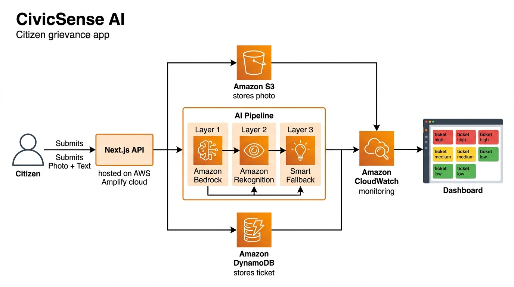

# 🏛️ CivicSense AI — Citizen Grievance Assistant

> **WeMakeDevs × AWS | First Commit Hackathon (Sept 17-20, 2026)**
> **Track:** Ship It | **Team:** 404 Not Founder | **Builder:** Naveen Singh (@codewithpiyus)

---

## 🎯 Problem

Municipal complaint portals across India suffer from **poor categorization, vague reports, and zero actionable routing**. Citizens report issues like potholes, garbage dumps, or broken streetlights — but the reports go into a black hole with no AI triage, no urgency scoring, and no automated department routing.

## 💡 Solution

**CivicSense AI** lets a citizen upload a photo of a civic issue and describe it in **any local language**. The app uses a **3-Layer AWS AI Pipeline** to:

1. 🔍 **Detect** objects in the image (garbage, road damage, stray animals)
2. 📂 **Categorize** the issue and assess urgency (High / Medium / Low)
3. 🏢 **Route** a structured ticket to the correct municipal department
4. 📊 **Display** all dispatched tickets on a live public dashboard

## 🏗️ Architecture

```
Citizen → Next.js (AWS Amplify) → API Routes
                                      │
                    ┌─────────────────┼─────────────────┐
                    ▼                 ▼                  ▼
            AWS Bedrock         AWS Rekognition    Smart Fallback
          (Nova Lite AI)       (Image Labels)     (Keyword NLP)
                    │                 │                  │
                    └─────────────────┼─────────────────┘
                                      │
                              ┌───────┴───────┐
                              ▼               ▼
                          AWS S3          AWS DynamoDB
                       (Images)          (Tickets DB)
                              │
                              ▼
                      AWS CloudWatch
                      (Pipeline Logs)


## ☁️ AWS Services Used (6 Total)

| # | Service | Purpose |
|---|---------|---------|
| 1 | **Amazon S3** | Secure image storage for grievance photos |
| 2 | **Amazon DynamoDB** | NoSQL database for structured ticket logging |
| 3 | **Amazon Bedrock (Nova Lite)** | Multimodal AI for intelligent issue analysis |
| 4 | **Amazon Rekognition** | Computer vision to detect objects in photos |
| 5 | **Amazon CloudWatch** | Centralized pipeline event logging |
| 6 | **AWS Amplify** | Full-stack hosting with CI/CD from GitHub |

## 🚀 Getting Started

```bash
git clone https://github.com/YOUR_USERNAME/civicsense-ai.git
cd civicsense-ai
npm install
npm run dev
```

### Environment Variables (`.env.local`)

```env
MOCK_MODE="false"
AWS_REGION="us-east-1"
AWS_ACCESS_KEY_ID="your_key"
AWS_SECRET_ACCESS_KEY="your_secret"
S3_BUCKET_NAME="your-bucket-name"
DYNAMODB_TABLE_NAME="CivicTickets"
```

## 🧑‍⚖️ What I Learned

- Implementing **multimodal AI** with Amazon Bedrock's Converse API
- Using **Amazon Rekognition** for real-time image label detection
- Building **graceful degradation** with a 3-layer AI fallback pipeline
- Deploying serverless full-stack apps on **AWS Amplify**
- Working with **DynamoDB** for NoSQL document storage and **S3** for object storage
- Monitoring production pipelines with **Amazon CloudWatch**

## 📚 References & Acknowledgements

See [REFERENCES.md](./REFERENCES.md) for open-source repositories, architectural design patterns, and AWS documentation referenced during development.

## 👤 Team: 404 Not Founder

- **Naveen Singh** (@codewithpiyus) — Solo Builder

---

Built with ❤️ for India's cities | WeMakeDevs × AWS First Commit 2026
